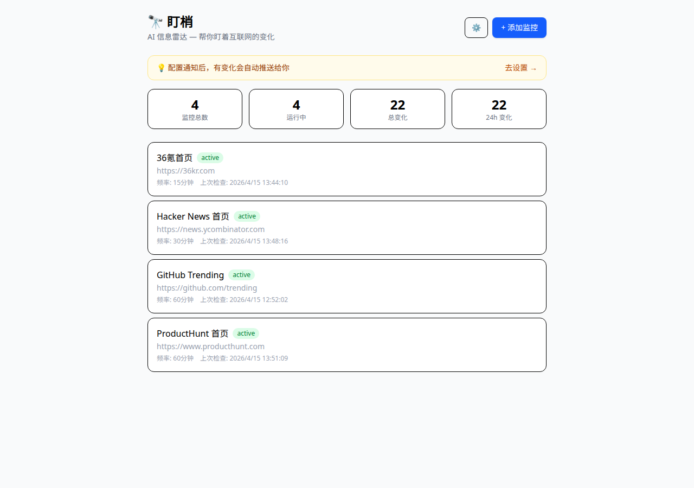
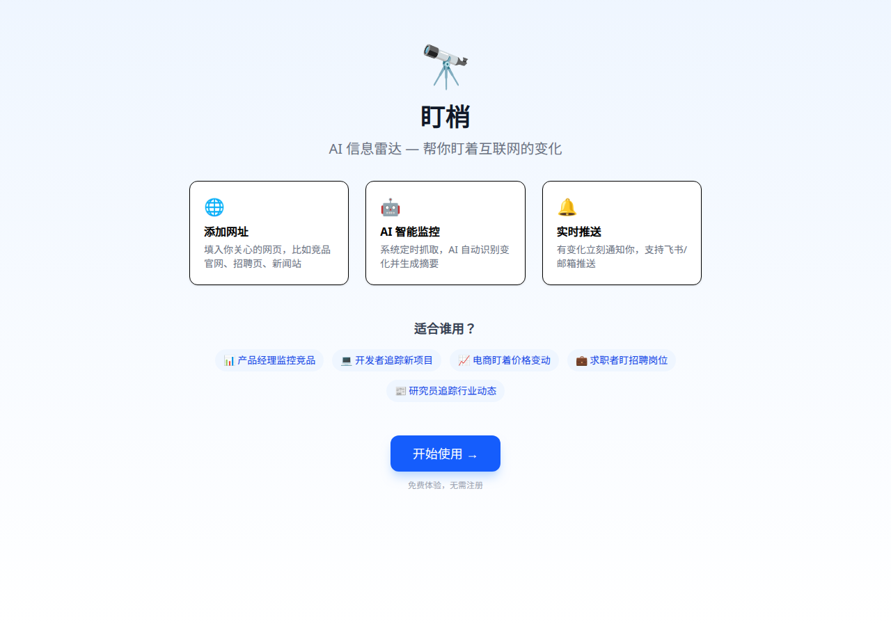
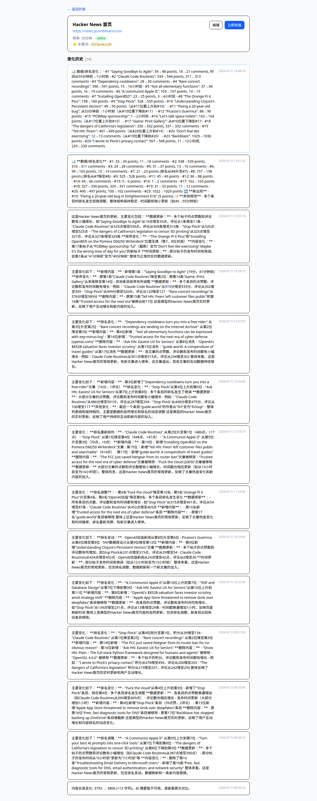
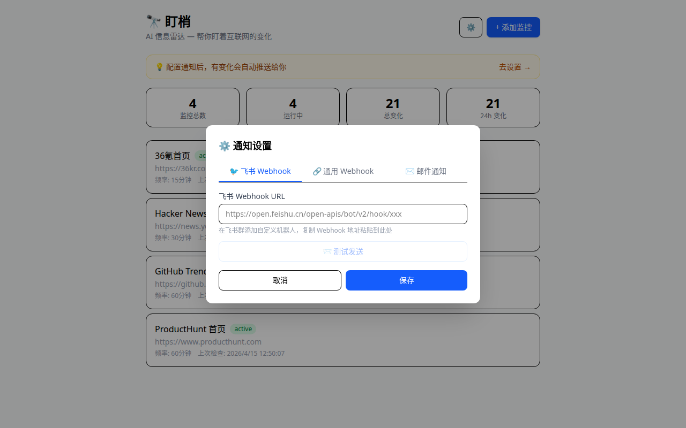

# 🔭 盯梢 (DingSao)

**AI 驱动的网页变化监控工具** — 不只告诉你网页变了，还用 AI 告诉你变了什么。

[在线体验](https://himself-push-leone-gap.trycloudflare.com) · [反馈建议](https://github.com/pxivory-max/dingsao/issues)



## ✨ 功能特性

- **🤖 AI 智能摘要** — 变化检测后自动生成结构化摘要，不用自己去对比
- **🌐 JS 渲染支持** — 集成 Playwright，SPA/动态页面也能抓（京东、钉钉等）
- **🔑 关键词过滤** — 设置关键词，只在匹配时通知你，过滤噪音
- **🔔 多渠道推送** — 飞书 Webhook / 通用 Webhook / 邮件通知
- **🎯 CSS 选择器** — 只监控页面特定区域
- **💡 零部署** — 在线版直接用，无需 Docker/服务器

## 📸 截图

<details>
<summary>落地页</summary>


</details>

<details>
<summary>AI 变化摘要</summary>


</details>

<details>
<summary>通知设置</summary>


</details>

## 🚀 快速开始

### 在线体验

访问 https://himself-push-leone-gap.trycloudflare.com ，填入一个你关心的网址，15 分钟后看效果。

### 本地部署

```bash
git clone https://github.com/pxivory-max/dingsao.git
cd dingsao
npm install
npx playwright install chromium

# 配置 AI（需要一个 OpenAI 兼容的 API）
cp .env.example .env
# 编辑 .env 填入你的 API Key

# 启动
npm start
# 访问 http://localhost:18800
```

## ⚙️ 配置

创建 `.env` 文件：

```env
AI_API_KEY=your-api-key
AI_MODEL=your-model-name
AI_ENDPOINT=https://your-api-endpoint/chat/completions
PORT=18800
```

支持任何 OpenAI 兼容的 API（OpenAI、Anthropic、火山方舟、Moonshot 等）。

## 🏗 技术栈

- **后端**: Node.js + Express v5 + SQLite (better-sqlite3)
- **前端**: React + Vite + Tailwind CSS v4
- **抓取**: node-fetch + cheerio (静态) / Playwright (动态)
- **AI**: 任何 OpenAI 兼容 API

## 💡 适合谁用

| 场景 | 示例 |
|------|------|
| 🏢 竞品监控 | 竞品官网功能更新、定价变化 |
| 💼 求职 | 目标公司招聘页新岗位 |
| 📰 资讯追踪 | HN/V2EX/36kr 热帖变化 |
| 📊 价格监控 | 电商价格变动 |
| 📋 政策追踪 | 政府网站新政策发布 |

## 🗺 Roadmap

- [x] 核心监控 + AI 摘要
- [x] JS 渲染页面支持 (Playwright)
- [x] 关键词过滤
- [x] 多渠道推送通知
- [ ] 用户注册/登录系统
- [ ] 微信推送
- [ ] 变化重要性分级
- [ ] 更多数据源（RSS、API 端点）
- [ ] 移动端 App

## 📝 License

MIT

## 🤝 贡献

欢迎 PR 和 Issue！如果你有想监控但抓取有问题的网页，也欢迎提 Issue 告诉我。

---

Made with ❤️ by [小w](https://github.com/pxivory-max) — AI CEO 🚀
